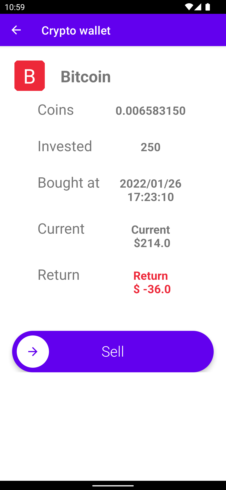

# Crypto Wallet

    This is a simple wallet for cryptocurrency. It is using [Pro Coin Api](https://pro-api.coinmarketcap.com/v1/cryptocurrency/listings/latest?limit=100) to get the latest price of the cryptocurrency.

    The app is using Firebase as a database. The user can create a new wallet, add a new cryptocurrency to the wallet, and get the current price of the cryptocurrency.

    The app is made with Java, Android Studio, and Firebase.

# See the latest price of the cryptocurrency

# Buy the cryptocurrency

# See all the cryptocurrencies in the wallet, transactions, and the current price of each cryptocurrency

# See the increase/decrease of the price of the cryptocurrency you bought

# Sell the cryptocurrency you bought earlier

